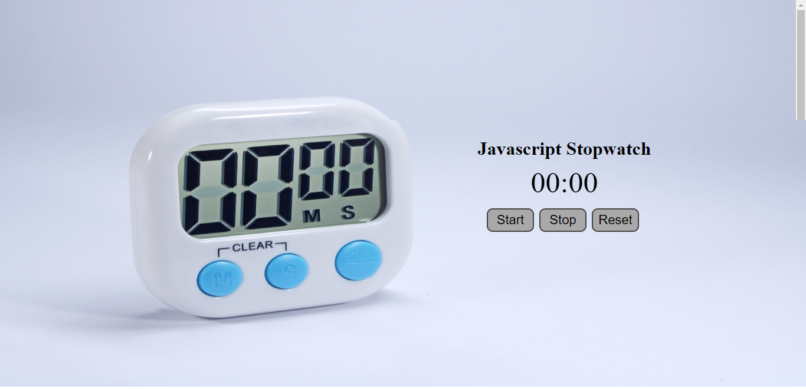

## Javascript Stopwatch

### Hello, I am Dipanshu Shukla

I have build stopwatch with the help of `HTML`, `CSS` and `JavaScript`.

``` Learning Key points ```
- Adjusting Background Image on the page through `CSS`.
- `Javascript`: Use addEventListener for each button.
- `Javascript`: Used setInterval Higher Order function.
  
This is the live link of the project.

Checkout Here [Live Link](https://dp-js-stopwatch.netlify.app)



